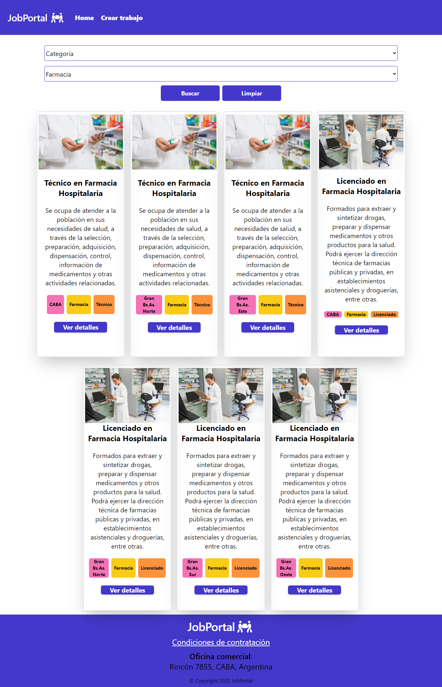
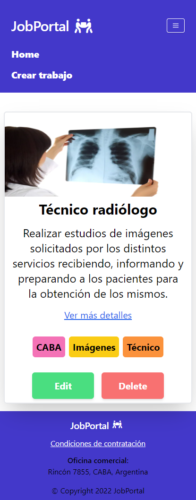

# Portal de trabajos de uso interno 

> *Proyecto del módulo 3 de JavaScript para Ada ITW*   
---
### [¡Hecha un vistazo!](https://vrocioquiroz.github.io/Tp-Jobs/)

Soy Rocio Quiroz y mi proyecto consiste en un sitio web de un portal de trabajos de uso interno empresarial.    
El sitio permite al usuario ver los puestos de trabajo disponibles con una descripcion del mismo y 'tags' de identificacion por zona, grado/jerarquía del puesto y categoria.
También podrá filtrar y buscar a través de dichos identificadores, editar los puestos de trabajo y crear nuevos.

### Mi sitio contiene: 
- Sección de links de navegación (Home, Crear trabajo).   
- Página principal donde se verán las cards de los puestos de trabajo con sus respectivos botones, los cuales permitirán realizar diferentes acciones al usuario.    
- Sección para ver en detalle un único puesto laboral, en la que el usuario podra ver más detalles del mismo, eliminarlo o editarlo.
- Al editar un puesto se verá un formulario con los datos del mismo ya precargado que el usuario podrá modificar a sus necesidades. 
- Al crear un nuevo puesto laboral se verá un formulario donde se cargarán los datos del mismo.
- Al eliminar un puesto de trabajo se le pregunta al usuario si realmente desea realizar dicha acción o si desea cancelar el proceso.
- Pié de página con datos de la empresa, logo que llevará a la página principal y link que llevará a la información de condiciones de contratacón.

### Diseño
   

---

### Tecnologías utilizadas para crear este sitio:
:small_orange_diamond:  HTML5

:small_orange_diamond:  Tailwind CSS     

:small_orange_diamond:  JavaScript

:small_orange_diamond: Web MockApi (API) 

Con ellas desarrollé la estructura, los estilos y su funcionalidad. Con el sitio de MockApi generamos los datos (puestos laborales) con los que el usuario hará interacción en el sitio. 

---

### Otros detalles téccnicos

- Diseño responsivo multiplataforma.
- Deployado y accesibilidad desde una URL.
- Utilización de Api (https://mockapi.io/projects) y funciones asincrónicas.  

---
